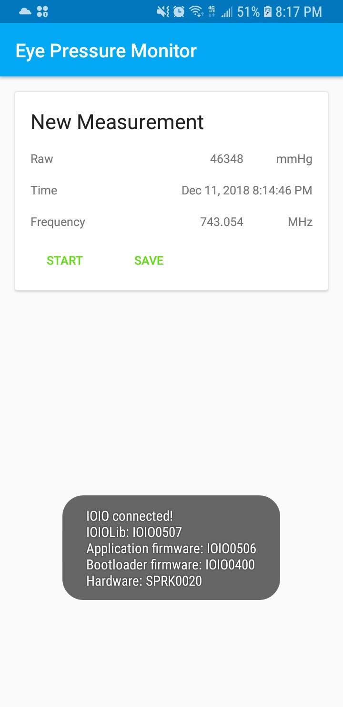

# Abstract

The document describes a mobile application that takes information from an attached device. The device consists of an IOIO board connected to a custom device that measures the frequency of a given waveform. The device was designed by another student for their senior project, which I am taking over. This device is connected to an IOIO board which is a board designed by a Google employee which works with an android phone in order to create applications that work with embedded systems. The board comes with an API and connects to the phone via a micro-USB. The application takes this data and records it both as a raw number but also as a frequency as measured by the custom device. The application stores the gathered information locally and then displays it on a set of graphs where each graph displays one kind of data calculated from the device.

# Introduction

## Eye Pressure Monitor

The eye pressure monitor is a custom-built board built by Mark Manuel, a former Electrical student from whom I took the project. The board is built to take a frequency of a given waveform and output the number of cycles in 500 microseconds. The original project was a board that was built to measure the frequency of an incoming waveform via an RF device. Since the application did not care whether the RF device was functional or not, my version of the project simply used the calculations provided in his project to calculate the frequency. His project found the frequency of a waveform to be the function below.

freq = clockTicks * 8 / 499 

I trusted that his project would accurately calculate the frequency of a given waveform using the following equation. This equation was in the code I received for the board.

The purpose of designing a device that would calculate a basic frequency is to send out a single known frequency to a device and the device would send back another frequency based on the eye pressure. This would be used to track the progress of patients with glaucoma. Eye pressure is an important metric in tracking the progress of glaucoma since fluid buildup in the eye is why Glaucoma can cause vision loss in affected individuals. In the primary open-angle glaucoma, the slow buildup in pressure causes damage to the optic nerve which can lead to vision loss. Although the exact cause of glaucoma is unknown, affected individuals can take medication to reduce eye pressure. One potential use for this device would be to measure the effectiveness of medications at home. Another reason to create a device to measure eye pressure is that many of the tools that are used to measure glaucoma require a specialist to use.

Currently, the most accurate method of measuring eye pressure is &quot;Goldmann Applanation Tonometry&quot; which requires a microscope to look into the eye while an orange dye and numbing agent is applied to the eye. In addition to this method, the Tonopen and the iCare are handheld devices that were created for measuring eye pressure. Although both devices are less accurate, they provide a method for testing eye pressure in an office where a proper microscope cannot be stored.  However, all these devices require professionals to make sure that they are used in a sanitary way and require that all measurements be stored in a doctor&#39;s office.  When the patient controls when and how the data is taken, a doctor or researcher is better able to see how the condition progresses over time.

Since I did not have access to the device that would send and receive these frequencies, I was not actually able to calculate the pressure from the eyeball.  The pressure measurement is not included in my project since it was not defined, and I did not possess the contact lens from which the initial frequency would be sent to and a reasonable result would be released. Instead, the raw measurement of the frequency-counter is placed where the pressure measurement is supposed to go. A future designer of the contact lens should be responsible for choosing an appropriate frequency to send out to the eye and to determine what is reasonable to be sent. From these two measurements, the pressure can be calculated and stored.

## IOIO Board

The Mobile Application is possible due to an IOIO board. It can be purchased from SparkFun Electronics who also provides some additional documentation for the board. The board can be used for both PC and mobile applications. For PC applications the board is plugged indirectly through the USB port. The board consists of 46 GPIO Pins as well as 3 GND pins, a 5V pin, a 3.3V Pin, and a Vin pin, and an LED. The circled GPIO pins on the diagram can support a 5V input while the rest of the pins are only able to support a 3.3V input. The LED can be used as a normal digital output in most cases. It is used in the bootloader mode to indicate entry into bootloader mode. Below is a picture of the board with no pins connected.

Figure 1: IOIO-OTG Board with no connections

The MCLR and BOOT pins are only used to upgrade the firmware. The firmware is loaded onto the board via IOIOdude. The IOIOdude software loads any firmware onto the board when the board is in bootloader mode. In this project, the standard IOIO firmware was used that was compatible with Android Studio 3.

I had to do this at the start of the project to make the board that I had compatible with the current version of Android Studio and Gradle. Having an up to date Gradle built can make sure that the board can take advantages of newer Android features such as the Room Persistence library.

The Charge Current Trimpot changes the amount of current supplied on the VBUS line of the USB. This is used to lower the amount of current supplied for battery supplied operations of the board in order to prevent battery drain.  The board also contains a host/device switch that can manually determine whether the board is a device or host. In Android applications, moving this switch will cause the phone to no longer communicate with the device properly. By using a data USB connector, the problem of host mode vs device mode is automatically determined.

Apart from the USB board the board also contains a 2-pin JST female power Jack. This can be used for applications of the board that require a power supply. This is not the case in this application as the device is expected to be powered by the phone. However, this was not the case for development.

For development, I connected both the phone and the device to my computer and used a bridge to connect the devices to enable debugging via Android Studio over the USB. The IOIO bridge connected the IOIO bridge in one port and the phone on another port. The bridge simulated a direct connection between the two devices while powering the device via a laptop. This way I could get information from the logs such as when data was read, how much data was read at once and what kind of data was being read. This is critical to finding out if the bytes that are being read are like those that come directly off the eye pressure monitor and can be read from a program like RealTerm which is commonly used for reading UART directly to a computer. This was also crucial for checking if my code was correct.

In addition to the IOIO bridge, the IOIO board comes with example code and a Java API. The IOIO board supports many different protocols for their boards including PWM, UART, I2C, SPI, and Digital I/O. Each of these protocols contains classes associated with the protocol and provide the necessary operations for reading and writing to these devices. For the UART protocol, there is a Uart class that allows the developer to create an object that contains the Rx pin, the Tx pin, the baud rate, and the parity. This allows the board to be read from accurately with the custom settings. This allows for a developer to use the pins that they know are appropriate and to connect different types of devices to the same device. For the LED, it is implemented as a Digital I/O pin where false means that the light is lit while true means that the light is not lit.

## Mobile Application

The mobile application was made specifically for Android phones using the Android Studio platform and Java. This decision was made since the IOIO board was compatible only with Android phones, and iPhones do not have official support for open-source peripherals. The IOIO board also had an API designed for it in Java.

Android Studio also had a lot of advantages for development including USB debugging via the Developer Options.  The USB debugging tools are unlocked on the phone by first going to the Settings app. For Android phones that have Android 8.0 and above, the user must go into the System menu as well. Then all users select &quot;About phone&quot; and tap &quot;Build number&quot; 7 times. When the user returns to the previous screen, the developer options are unlocked. Then the USB debugging can be enabled through the Developer Options menu[CITATION Con18 \l 1033]. USB debugging allows for the use of Android logging to gracefully report system information to the developer such as what is being read off of the Eye Pressure Monitor. In addition to this it allows a developer to see when an exception is being thrown. The developer can then decide whether to just add it to the logs or to cause a problem for the user. The logs can also tell the developer what the code of an application is doing at a moment in time. This allows for a robust development strategy which gives the application developer a lot of freedom in deciding how a given device.

Android Studio not only is an IDE for Java Development with logging but also has a framework for creating User Interfaces. The User Interfaces are created using XML files that contains all the properties of the User Interface. Android Studio also allows these designs to be seen in a preview so that most of the work of developing the application was in the back end. Once the UI had a mock up, the user could drag and drop the necessary elements into the correct positions. Android also has a number of classes and predefined functions that handle the operation of the User Interface and allowed the focus of the application to be on getting and storing the measurements.

The app also relies heavily on System messages to inform the user on the state of the device and of the Application. These messages are known as toasts. They are messages that are displayed in a grey rounded box and are displayed for a certain number of seconds before going away on their own.

# Frequency Counter

The Eye Pressure monitor is a board that takes the frequency of a waveform. This is the calculation that I am taking from the board in order to get a frequency measurement of a given waveform. Each of these frequencies is given by a 16-bit number. Thus, the frequency given is taken from the reading of two UART cycles. Since this is a small amount of data, the speed of UART is not an issue for receiving real-time information.

I redesigned the firmware of the board to work to better work with a mobile application. I changed the output of the board to only be the number of ticks collected in 500 microseconds. This is outputted immediately so the phone can read the most output from the board as possible. Although this is a lot of bits to be outputted, this makes sure that only one type of information is outputted to the board so that the bits coming into the board only has one possible interpretation, which is the number of ticks. The only thing the Frequency-Counter does is output the bits of the counter to the board. The following picture shows the Frequency Counter.

Figure 2: Frequency Counter Attached to a Function Generator

# UART using IOIO board

An IOIO board is a board designed by a Google employee to work with an Android device with a micro-USB. The board implements any standard protocol to a USB device. The protocol I chose was UART because it was implemented by the person that I inherited the project from. The UART uses a baud rate of 38400. This is hard-coded into both the application and the board&#39;s firmware and into the application. Using a previously agreed upon baud rate is good for both the developer of the firmware and the developer so that the measurements can be sent appropriately and received appropriately. This rate was chosen so that the most accurate data can be sent as quickly as possible.

The challenge with implementing UART is that the original protocol was built for a 3.3V pull-up pin but the board needed 5V. Luckily there was a 5V pin on the board that only transmits that value. Any of the GPIO pins can be used for implementing UART if they support 5V inputs. I used pins 2 through 5 because they were part of a long string of 5V tolerant pins. The wiring diagram in the picture below in order shows all the pins that were used.

Figure 3: Wiring between the IOIO board and the Eye Pressure Monitor

The Board collects the number of ticks of the clock from the board via the Rx pin. This pin is read by the application. The TX pin is also defined in the application, but no data is written to it because the application does not require it. The RTS and CTS pins are not defined in the application but must be placed in pins 2 and 5 respectively. This is not explicitly defined in the software, but I found it essential through testing to place the pins in these positions in order to transmit data to and from the board correctly. The 5V pin is connected to a 5V pin that always outputs 5V when connected to a phone. The GND pin is also always connected to a special GND pin.

The board also contains an LED. The LED is used for when a read is blocking, and the board is powered on. The LED was chosen for hardware debugging as it was the most visible sign on the board that something was off.  If all is working correctly the LED should never be visibly lit. However, the connection between the pins and the board can become weak, so the LED is a good indicator of when the connection is not performing as it should. This is also a signal that the board is connected to the phone but not to the frequency counter.

# Receiving Measurements

The mobile application receives input from the micro-USB from the IOIO board. The IOIO board has an accompanying API for Android Studio that has an object for receiving data via UART. The Rx pin was set to pin 3 per the wiring diagram. The Tx pin was set to 4 per the wiring diagram. The baud rate was set to the agreed upon 38400. Then the UART was open to receiving data through a function that is run in a loop while the board is connected. The functionality of this loop is set by the API. In order to display the current measurement, the start button is pressed. If the board is not connected to the application, a toast is displayed that explains that since there is no board connected, there must be no current measurement. The toast looks like the screenshot below.

Figure 4: Measurement with Nothing Connected

Otherwise, the measurement from the most recent reading is displayed on the screen. This includes the raw data presented as an integer, the frequency, and the current time. The raw value is displayed as a Pressure measurement.

Figure 5: Measurement with Device Connected

When the device is connected to the phone another toast message is displayed that shows the device information the Figure below shows the message from the IOIO board used. It shows the version of IOIOLib that is used as well as the Application Firmware version and the Bootloader firmware. I chose these as they were the most up to date versions that were compatible with the IOIO OTG board.

Figure 6: Toast When Device is Connected

As when the device is disconnected from the phone another toast message is displayed. The IOIO is disconnected when the user manually disconnects the device or when the user switches to one of the two provided graphs.

Figure 7: Toast When Device is Disconnected

# Storing Measurements

The Measurements are stored in a local database using the Room Persistence Library which provides a layer of abstraction over SQLite. This is highly recommended by Google, so SQLite is the database framework used by Android to store user data locally. This was chosen over maintaining a web server for both security and cost concerns. The Room Database consists of several classes and annotations that create the Room Database. In the application, the class AppDatabase creates the Room Database which contains the entities within the database. The entities are representations of the tables in the database as Objects. In this project, the Measurement entity is the only table in our database. This is done because there is only one type of data that we are storing in our table for our database.

In addition to a normal database, we also needed to store converter functions for the Dates because the Room Library does not directly support dates. Instead, a date is stored as the number of milliseconds since the epoch. I created a simple converter class, Converters.java, which the database calls to convert in between java.util.Date and the long used for the system times. The database also contains a Database Access Object or a Dao that manages how the database is accessed. In this application, MeasurementDao.java is the interface that manages the Database Access Object.

The Measurement Database supports getting all the Measurements and inserting a single measurement into the database. Since the Data Access Object is an interface and not an object by itself, it cannot be used directly. Instead, a ViewModel and a Repository. The Repository can be used to manage multiple entities, but in the case of this application, it handles getting all the data after a given date and inserting the data. Insertion into a database is different than getting data in that it must be done asynchronously. This requires that this part of the application be done in a different thread than the rest of the application. This is done so that inserting the information into the database doesn&#39;t interrupt the UI if it takes a long amount of time.

Then the ViewModel is an abstraction of the Repository object. This contains the measurements and contains two constructors, one that includes a custom date and another with a default date of six months ago. This is done so that a default mode can be done for the date.  The ViewModel makes sure that getting all the measurements are done at creation and inherits from AndroidViewModel. This allows us to take advantage of inheritance from the Room API. Each of the graph displays interacts with only the ViewModel.

# Displaying the Measurements

The frequency and Raw data are displayed on a series of graphs. Each of these graphs is its own activity so that as much of the screen as possible can be dedicated to displaying the data. For each graph, the x-axis is time while the y-axis is either the frequency or the raw data. This was done so that the measurements over a day can be viewed along with longer-term results. The graphs were created using an API called GraphView. This API has several types of graphs including line graphs, bar graphs, and point graphs. The API also allows the views to be scalable which allows the user to see as much or as little of the data as they need in order to make an accurate judgment of their measurements. Thus, the amount of data shown can be done in a variable way depending on the data stored. This is done so to keep the memory footprint of the application to a reasonable level. In addition, it creates a more interactive user experience.

Figure 8: Raw vs. Time

Figure 9: Frequency vs. Time

There is a space in the navigation bar for each measurement graph. The navigation showing each graph is shown below. Each of the graphs has its own activity so that they can take up the entire screen so that the most data can be displayed as possible. This is advantageous for a mobile application where the screen is already small. This is important to be able store data in a way that makes use of the data.

Figure 10: Application Navigation

# Future Recommendations

## Changing the application to work with another protocol

Currently, the application works with UART which is an older protocol from getting data from a board. A future developer can adapt the application to use another protocol such as SPI or I2C. If this change were to occur, the developer should reflash the board with the new code and test whether it outputs the correct data. Once that is complete, the uart\_ object should be changed to an object that represents the new protocol as described by the API for that protocol. Then the proper read function must be implemented in the loop function that reads from the device into the volatile cur value. This value is volatile to alert the developer that it does not change in the UI thread and must be copied into another value to be worked with in a stable manner.

## Changing the Database to work with Alternate Entities

In order to work with a different kind of measurement, the database columns would need to be altered in order to work with new kinds of data. This would be useful if a different device were connected to the IOIO board. The column names would need to be a string that reflects the type of information that would be collected. For debugging purposes, it is useful to keep a raw version of your data in the table in case there is an issue with the calculations that you need to fix later. This can easily be done from another application that has access to the database. If you are using the same code, the Measurement class would need to be changed to reflect these new column names. Then, the version of the database would need to be incremented so that the new table would not interfere with the old data. This is important so that the results of grabbing a measurement are not inconsistent. In addition, the number of graphs may need to be changed if you are adding a column to the database, the x-axis of any graph should always reflect the time at which the data was collected while the y column should always reflect the type of data being taken. This is important to make sure that both the x and y values show up appropriately on the graph.

## Creating the Contact Lens

Since the Eye Pressure Monitor is a device that is designed to get the pressure of the eyeball based on two frequencies, there needs to be a contact lens designed to send and receive these different frequencies. This needs to be integrated into the Eye Pressure Monitor. A safe frequency needs to be delivered to the eye as not to damage the eye or to be detectable to the eye. Then the eye pressure must be able to receive this frequency in order to make calculations. Then the application must be informed as to what frequency is being sent to the eye so that it can make an accurate measurement of the pressure.

# References
[1] American Optometric Association, &quot;Glaucoma,&quot; 2018. [Online]. Available: https://www.aoa.org/patients-and-public/eye-and-vision-problems/glossary-of-eye-and-vision-conditions/glaucoma. [Accessed 1 December 2018].

[2] GEM Clinic - Glaucoma &amp; Eye Management, &quot;About Glaucoma,&quot; [Online]. Available: http://gemclinic.ca/about\_glaucoma.php. [Accessed 1 December 2018].

[3] SparkFun Electronics, &quot;IOIO-GTG Hookup Line,&quot; [Online]. Available: https://learn.sparkfun.com/tutorials/ioio-otg-hookup-guide/ioio-board-overview. [Accessed 1 December 2018]. 

[4] Y. Ben-Tsvi, &quot;home,&quot; 14 October 2016. [Online]. Available: https://github.com/ytai/ioio/wiki. [Accessed 1 December 2018]. 

[5] Y. Ben-Tsvi, &quot;IOIO Bridge,&quot; 26 November 2012. [Online]. Available: https://github.com/ytai/ioio/wiki/IOIO-Bridge. [Accessed 1 December 2018].

[6] &quot;Configure on-device developer options,&quot; 21 September 2018. [Online]. Available: https://developer.android.com/studio/debug/dev-options. [Accessed 1 December 2018]. 

[7] Y. Ben-Tsvi, &quot;UART,&quot; 6 January 2015. [Online]. Available: https://github.com/ytai/ioio/wiki/UART. [Accessed 1 December 2018]. 

[8] Y. Ben-Tsvi, &quot;Getting To Know The Board,&quot; 25 January 2013. [Online]. Available: https://github.com/ytai/ioio/wiki/Getting-To-Know-The-Board. [Accessed 1 December 2018]. 

[9] Google, &quot;Room Persistance Library,&quot; 23 October 2018. [Online]. Available: https://developer.android.com/topic/libraries/architecture/room. [Accessed 20 November 2018]. 

[10] Google, &quot;Save data in a local database using Room,&quot; 6 November 2018. [Online]. Available: https://developer.android.com/training/data-storage/room/. [Accessed 20 November 2018]. 

[11] Google, &quot;Android Room with A View,&quot; [Online]. Available: https://codelabs.developers.google.com/codelabs/android-room-with-a-view. [Accessed 20 November 2018]. 

[12] J. Gehring, &quot;GraphView,&quot; 2018. [Online]. Available: http://www.android-graphview.org/. [Accessed 21 November 2018]. 
